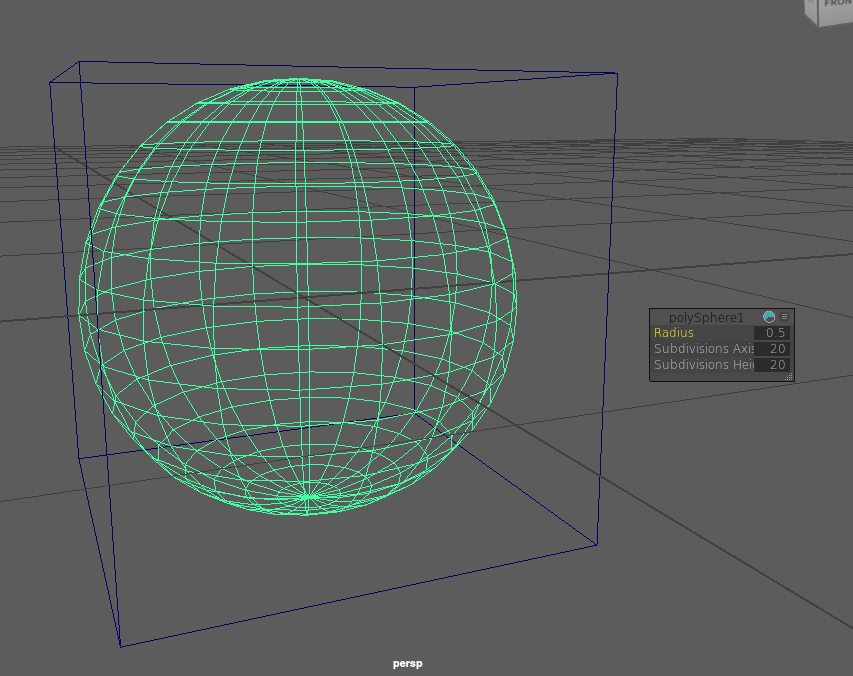

Savannah Kreider s5501023 CFGAA Assignment

# Assignment Ideas/Work Doc : 3D scoops game 
- ----------------------------------------------------------------------------------------------------------------------------------------------
## Video:(Itterations in Video-Tests folder)
------------------------------------------------------------------------------------------------------------------------------------
- Gameplay Controlls:
- wsad key controlls to go in xz coordnates
- qezx key controlls to go diagonally in xz coordnates
- key 1 to reset viewport
- left mouse button to rotate around scene, right mouse button to move scene up, down, left, or right
-------------------------------------------------------------------------------------------------------------------
- Requires BRFORE build:
- c++ compiler supporting C++17, Qt5 (or) Qt6, NGL (NCCA Graphics Library),and vcpkg
- 
- Building- make sure that you have CMakeLists.txt file, type into terminal:
- mkdir build
- cd build
- cmake ..
- make
- 
- OR in your terminal:
- clion .
- (in CLion have CMakeLists.txt, ParticleNGL and build ParticleNGLCopy Shaders)
-----------------------------------------------------------------------------------------------------------------------------------------
##  Design of classes/structures:
-
- Block.cpp- stores type, if the falling block is alive, initial speed, position, movement over change in time, point value, drawing the block
- Cone.cpp- stores lives, player points, speed of controlled cone, updating score and lives, distance between vectors to aid in collision checking, modifying states and values based on collision, drawing out the user controlled item
- main.cpp- creating the playable window, another window for button settings, and continually playinf till it closes
- NGLScene.cpp- drawing the entire scene, setting up shader,  timers for game play, true collision changes of updating the cone based on collided scoop and ending the scoop, key controlled cone, generation of falling scoops, and game loop via time event
- NGLSceneMouseControls.cpp- allowing rotation of the scene through  left and right clicks of the mouse

- Directory Structure:
-
- src: main.cpp, NGLScene.cpp, NGLSceneMouseControls.cpp, Block.cpp, Cone.pp
- include:main.h, NGLScene.h , Block.h ,Cone.h
- CMakeList.txt
- .github (and .gitignore)
- README.md
- -----------------------------------------------------------------------------------------

## Annotated Bibliography:
----------------------------------------------------------------------------------------------------
- Scoops (2008)by NimbleBit:
- MobyGames. (n.d.). Scoops (2008). [online] Available at: https://www.mobygames.com/game/49407/scoops/.
- 
- Originally, the game that I had in mind to expand upon was Scoops. You tilt your phone side to side to move the cone back and forth on the screen in doing so avoiding trash but collecting scoops to build the tower up. - - However, making it 3D means moving up the orthographic camera isnt as viable for a perspective as eventually it becomes too tiny to see everything properly either the board and/or the falling objects. So trying to come up with a more creative workaround to implement a game to this. While it does give me a basis as to powerups being special scoops, trash to avoid taking a life, and stackable scoops that earn point, it requires modification to be changed to 3D on a computer. Having controlls be on a common wsad movement, allowing to use the mouse to rotate around the enviroment, and trying to see how I can still collect without running into visual issues with the game is what I need to further explore.
-Overall, this game gives me the basic framework of my game, its general rules that I can then compare to similar games like this one , and add on my own solutions to the issues mentioned.
-
- Game Programming Patterns:
- Gameprogrammingpatterns.com. (2014). Game Loop · Sequencing Patterns · Game Programming Patterns. [online] Available at: https://gameprogrammingpatterns.com/game-loop.html.
- 
- Having the stucture of:
- while (true)
{
  processInput();//all user inputs from last update
  update();//updating the game 
  render();//renders to screen as frame
  sleep(start + MS_PER_FRAME - getCurrentTime());//delay render
}
- will allow me to have user inputs handled since the last call, updates it visuall, then renders it on the screen. The game loop will run continuously and can be used to control the rate of gameplay. However, Robert Nystrom mentions two things is to control  that th game dosen't run too fast if it processes fames too quicky and to not force patterns. While a game loop will be benificial, fps also needs to account for thus a sleep function ise useful. However, its fails to consider what happens if the computer can't handle the calculations thus revising to account for lag as well to catch up with the player:
- double previous = getCurrentTime();
double lag = 0.0;//ensures catch up of multipe updates occures gradually over time making for a smoother gameplay
//MS_PER_UPDATE-consistent rate indepentent of system performance
- while (true)
{
  double current = getCurrentTime();
  double elapsed = current - previous;
  previous = current;
  lag += elapsed;

  processInput();

  while (lag >= MS_PER_UPDATE)
  {
    update();
    lag -= MS_PER_UPDATE;
  }

  render(lag / MS_PER_UPDATE);
}
-
- Jon's Teapot: Getting Started with the Programming Assignment The SpaceShip
- Jon Macey (2012). Jon’s Teapot: Getting Started with the Programming Assignment Pt 4 The SpaceShip. [online] Jon’s Teapot. Available at: http://jonmacey.blogspot.com/2012/02/getting-started-with-programming_8527.html
- 
- Taking a look at how someone that has handle keys in NGL and overall game loops, there's a few things that I need to implement such as processing holding a key down consistently to continually move  by processing the key pressed in the object you want to move and draw it in the paintGL with a game loop.
- A common rounding error for calculating where the boundaries of the block (if an actual block is used) is a rounding error on the cone opsition and the block distance, where the calculated error is clipped as the distance is in a sphere shape for catchDistance and distance = (cone position - block position ) length  it would calc in a sphere shape instead of the actual geometry of a block
- anything outside of the sphere would read as if it didn't collide with the block unless further calculations are made

- Initially I had attempted to do a GJK collision algorithm, however because I continually got computational errors in my version trying to account for the cone and the initial scoop. However, due to there being an initial scoop on top and only needing to account for a box, I adjusted to go to the Anti Aliasing Bounding Box(AABB)
- MDN Web Docs. (n.d.). 3D collision detection. [online] Available at: https://developer.mozilla.org/en-US/docs/Games/Techniques/3D_collision_detection.
- MDN explains that the AABB is the quickest algorithm to detect whether two game entities are overlapping or not which is important for a game with real-time rendering (or as close as possible) and it covers 3 different types, point, sphere, and box type collisions
- Once completing this, I realized creating an emitter class for the scoops above the playable area would be the most efficient way of handling the generation of the falling Blocks to generate above the same area of the valid play box while only changing the y
- However, instead of directly using an emitter, I use a generateRandom scoop to generate a scoop every x time and put it into a list. Once the scoops move based on time downward then I can implement removing scoops that hit the floor ir collide, change points/lives depending on if they were supposed to catch or avoid
- Noticing the irregularities in speed when holding down buttons, I attempted to do a lerp on the cone movement and found out having a continually moving cove vs strictly user controlled crated two different types of game play for the user to balance.
- Due to the sizing of the scoops and the limitations of seeing the scene till about they 10.0f at y, I opted to have the scoop collect as opposed to stacking in 3D for fear of the player losing the cone scoop and control. Thus, I decided to modify from the inspired game with a similar game that also catches fallen objects
- - ----------------------------------------------------------------------------------------------------------------------------------------------
----------------------------------------------------------------------------------------------------------------------------------------

## Initial Research

- Sky Burger (2009) by NimbelBit:
- Wikipedia. (2023). Sky Burger. [online] Available at: https://en.wikipedia.org/wiki/Sky_Burger.
-
- Sky Burger's unique implementation of this style of game was that there were certain ingredients and certain amounts of ingredients that you needed to collect and then top off with a bun in order to complete the order, the closer you were to the correct order,the larger the 'tip' was. Using the money you could unlock other items, themes, and levels. While in the scope of this project I won't be going as robust as that,again its a way if I have time to expand upon my project in a challenging way for the game play. I could implement ingredents/challeges of what to collect or a casual mode.
-
- Tower Bloxx (2007) by Digital Chocolate:
  -PeakD. (n.d.). Tower Bloxx Deluxe - Perfect for Stress. [online] Available at: https://peakd.com/hive-140217/@musicandreview/tower-bloxx-deluxe-perfect-for-stress.
-
- Unlike the prior 3 game I've looked at, this one has the controlls above as you try to aim below to accurately build a tower as centered as you can. This one is also in 3D instead of 2D, so certian things in gameplay could be more useful as to how they solved certian issies. It adusts the camera height with each block placed so that when you're aiming it continues to swing side to side, adding to the difficulty of placing the block ontop. It is non rotatable cameraview, in more of a front view. Playing in this manner for a catching game instead of a aming game would be challenging. However things such as having a finite goal till it ends may be one way to stop a player going out of bounds of the game that it was reasonably built to. It also explores the effect that having aiming could affect the game play, perfect no swing and everything else would increase the swaying. I could implement a jitter as you're 'balancing' to create this effect if I dont visually see the stack  change past a certian number if its on the floor
-
- The My Little Pony Gameloft Wiki. (n.d.). Apple-Picking. [online] Available at: https://mlp-gameloft.fandom.com/wiki/Apple-Picking [Accessed 13 May 2024].
- Going in a similar game, in the mini game Apple-Picking, similarly to Scoops, you have to avoid the rotten apples, and catch as many ripe apples as you can in a time limit to get more coins. Green apples equal 100 coins, Red apples equal 1000 coins and rainbow colored (Zap) apples are 5 gems. This inspired me to put a time limit on my own game and expand upon what was given to the player as I continue to develop the concept for my 3D version of Scoops slightly modified 
- Patterns in C- Part 2:State :
- Peatersen, A. (n.d.). Patterns In C - Part 2: STATE. [online] Available at: https://www.google.com/url?sa=t&source=web&rct=j&opi=89978449&url=https://www.adamtornhill.com/Patterns%2520in%2520C%25202,%2520STATE.pdf&ved=2ahUKEwjilNbAveCFAxVgXEEAHXbIAYUQFnoECBIQAQ&usg=AOvVaw214ZWxK1HMAcGCyseQ0b7i.
- Patterns in C- Part 4 :Observer:
- Peatersen, A. (n.d.). Patterns In C - Part 4: OBSERVER. [online] Available at:https://www.google.com/url?sa=t&source=web&rct=j&opi=89978449&url=https://www.adamtornhill.com/Patterns%2520in%2520C%25204,%2520OBSERVER.pdf&ved=2ahUKEwjpkcDnveCFAxVSS0EAHYC9AcAQFnoECBYQAQ&usg=AOvVaw2TBLtvxukUpHV0Czg4XXXw
- Basing my game off of the two patterns State and Observer for things such as the menu, player event  inorder to reduce complexity while building flexibility in the game's development, while state is used for collisions of the blocks  and user inputs
------------------------------------------------------------------------------------------------------------------------------------
